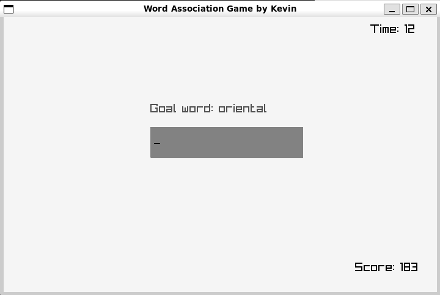
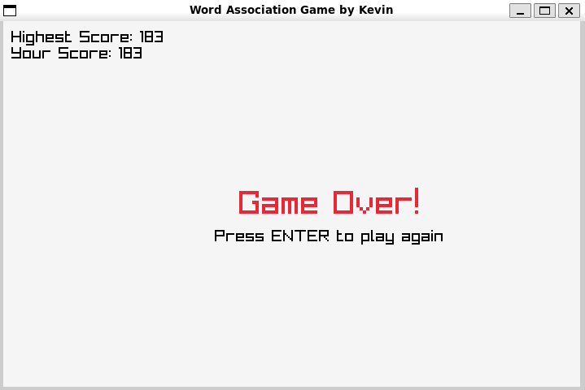

# Word Association Game

## What is it?

Word Association Game is an engaging, time-based word game that challenges players to come up with words associated with a given target word. It's a fun way to test your vocabulary and quick thinking skills!

## Getting Started

### Prerequisites

- C++ compiler supporting C++17
- Raylib library
- Make

### Installation

1. Clone the repository:
   ```
   git clone https://github.com/your-username/word-association-game.git
   ```

2. Navigate to the project directory:
   ```
   cd word-association-game
   ```

3. Build the game:
   ```
   make
   ```

4. Run the game:
   ```
   ./build/wordgame
   ```

## How to Play

1. When the game starts, you'll see a "Goal word" at the top of the screen.
2. Type words that you think are associated with the goal word.
3. Press Enter to submit each word.
4. You'll earn points based on how closely your words are associated with the goal word.
5. Try to score as many points as possible before the timer runs out!

Tips:
- Be quick! You only have 40 seconds.
- Think creatively. Sometimes unexpected associations can score high points.
- Don't repeat words. Each word can only be used once.

## How was this created?

This game was created using C++ and the Raylib library for graphics and input handling. The project structure follows common C++ practices, separating declarations (headers) and implementations.

Key components:
- `ScoreGraph`: Weighted graph data structure that stores word associations and scores
- `InputBox`: Handles user input and scoring
- `Timer`: Manages the game's time limit
- `Game`: Orchestrates the overall game flow

The word associations and their scores are stored in a CSV file, which is loaded into the `ScoreGraph` at the start of the game. This allows for easy updates and expansions to the word database.

Python was also used to generate the word association from a list of words and their associations. This script can be found in the `data` directory.

I used `https://github.com/MichaelWehar/Public-Domain-Word-Lists`'s 5000 most common English words as the base for the word associations and utilized the gensim library to generate word embeddings.

## Screenshots of the gameplay



